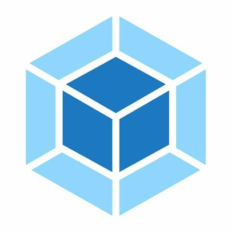
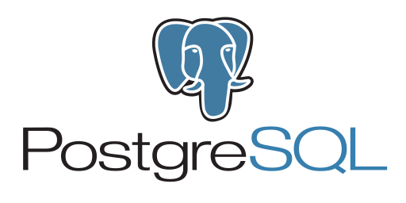
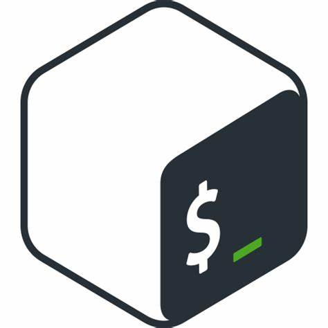

### About me

- Hi there 👋 I’m a full stack web developer and a passionate learner who loves to create beautiful and functional websites.
- 🌱 I’m currently learning C++ and Data Structures and Algorithms to improve me development skills
- 💬 Ask me about HTML, CSS, JavaScript, Bootstrap, React, Python, Django, Flask and anything web related
- 📫 How to reach me: you can email me at karim.maged2020@yahoo.com

## My Skills

### Front-End:

### Back-End:

### General:

